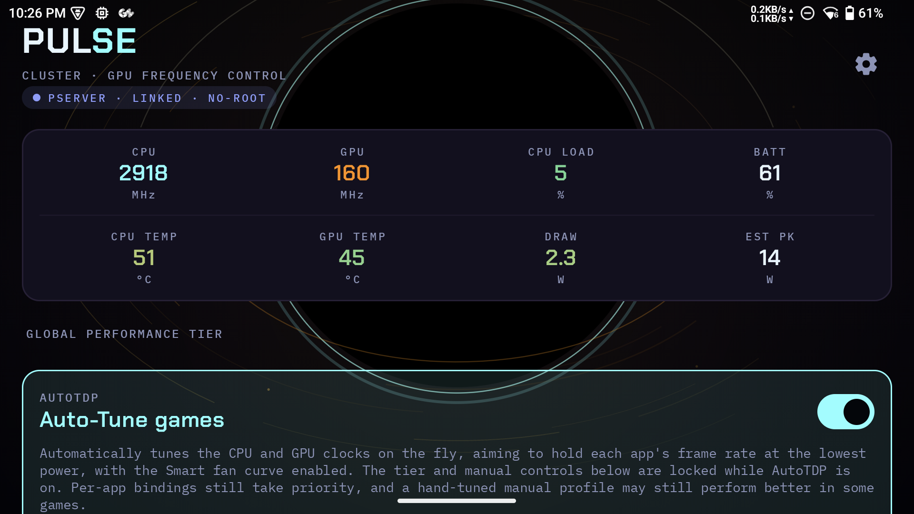
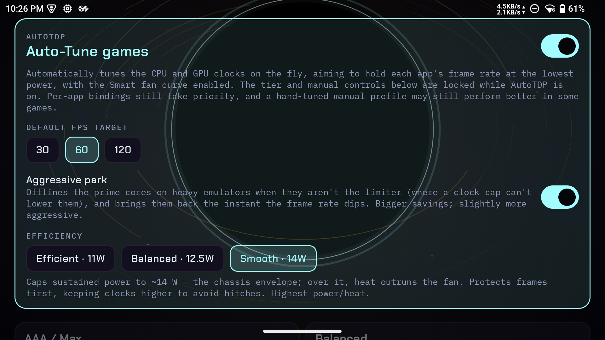
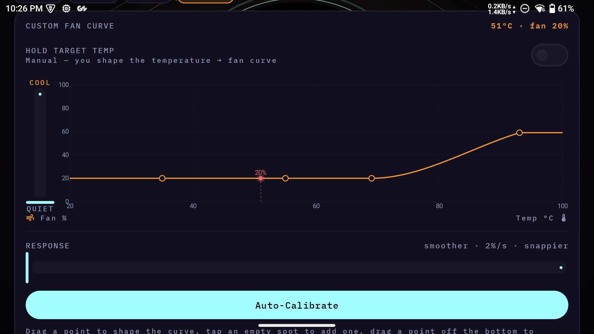
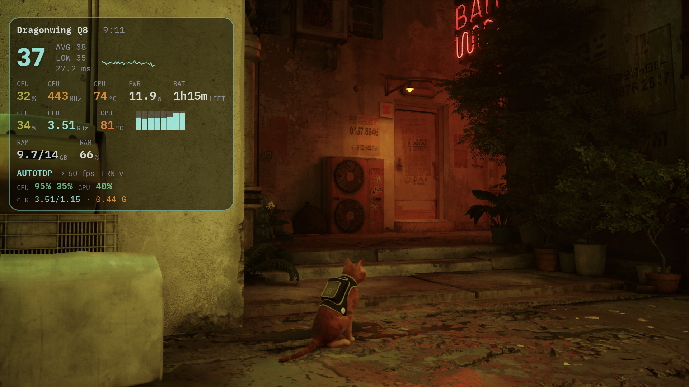
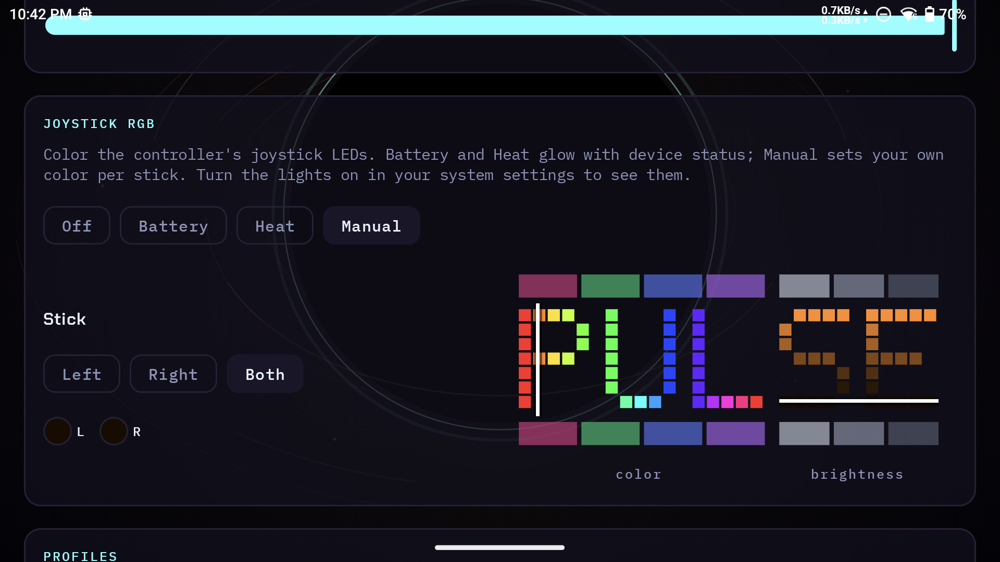
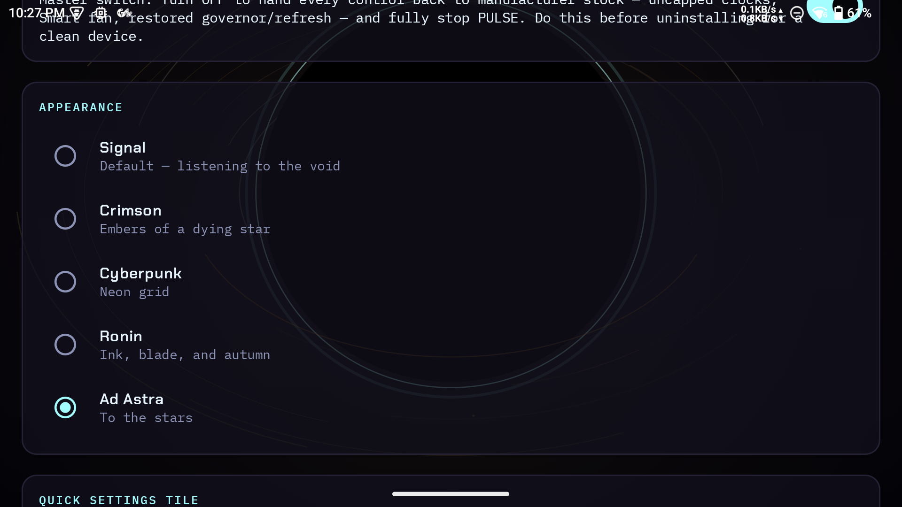

<div align="center">

# P.U.L.S.E.

### Performance Utility for Load and System Efficiency

*A no-root performance tuner for handheld gaming devices — give your handheld a brain.*




</div>

---

## What is PULSE?

I kept wanting two things from my handheld that felt mutually exclusive: **good, sustained frame rates** and **a battery that lasts (and a fan that isn't screaming).** Stock firmware gives you a couple of blunt "performance modes" and calls it a day. I wanted a knob for everything — and something smart enough to turn those knobs for me, per game, in real time.

So I built **PULSE**.

It is a per-cluster CPU/GPU tuner, a closed-loop **AutoTDP** controller that holds a target frame rate at the minimum power it can get away with, a closed-loop **Custom fan** controller, a live telemetry **HUD/OSD**, and joystick **RGB** control — and it does all of it **without Magisk and without user-granted root**. It drives the device's own built-in `PServer` service to write the protected sysfs nodes, the same no-root technique pioneered by ClusterTune (see [Attribution](#license--attribution)).

If your device ships that service, PULSE just works. If it does not, PULSE tells you it is incompatible and never asks you to root anything.

## Supported devices

| Device | SoC | `ro.soc.model` | GPU | Android |
| --- | --- | --- | --- | --- |
| **AYN Odin 3** | Qualcomm Dragonwing Q8 | `CQ8725S` | Adreno 830 | 15 |
| **AYN Thor** (Base / Pro / Max) | Snapdragon 8 Gen 2 | `QCS8550` | Adreno 740 | 13 |
| **Retroid Pocket 6** | Snapdragon 8 Gen 2 | `QCS8550` | Adreno 740 | 13 |

> PULSE reads each device's clusters, per-core frequency ranges, and GPU power levels live from sysfs at runtime, so it adapts to whatever the hardware exposes. Other Qualcomm handhelds with a `PServerBinder` service may work — but the three above are what it is tuned and hardware-tested on.

> [!WARNING]
> **PULSE changes CPU and GPU frequency limits.** That affects stability, thermals, battery life, and performance, and is **not guaranteed safe for your hardware.** Use it only if you understand what frequency limits do and accept the risk. The device's own kernel thermal limiter always stays in charge underneath PULSE, but you are still the one turning the dials.

---

## Features

### AutoTDP — the brain

This is the headline. **AutoTDP is a closed-loop controller that auto-tunes your CPU and GPU clocks, in real time, to hold a target FPS at the lowest power possible.** Point it at a game, give it a target (e.g. 60), and it does the rest — trimming clocks while frames are smooth, giving them back the instant a scene gets heavy, and learning each game's floor as it goes.

It has an efficiency-to-smoothness bias with three modes, set globally or per-app:

| Mode | What it prioritises | On the Odin it caps draw at... |
| --- | --- | --- |
| **Efficient** | Lowest power, quietest, coolest | ~11 W |
| **Balanced** | A sensible middle | ~12.5 W |
| **Smooth** | Best frames, holds clocks higher | ~14 W |

The watt number is a **ceiling, not a target.** AutoTDP always uses the least power it can to hold your frame rate — on a light game it sits far below the cap; it only climbs toward the cap when a game genuinely demands it, and never crosses it (so a tiny chassis cannot cook itself chasing frames it cannot sustain).

<details>
<summary><b>Guide: getting the most out of AutoTDP</b></summary>

<br>

<div align="center"></div>

- **Turn it on, pick an FPS target, play.** With no per-app setup, AutoTDP becomes the default for any foreground game.
- **Pick a mode for the moment:** *Efficient* for long battery sessions and emulators, *Smooth* for a demanding title where you want every frame, *Balanced* when you are not sure.
- **Per-app overrides win.** Set a different mode (or target) for a specific game and PULSE remembers it.
- **Honest expectations:** a genuinely heavy AAA title on a small handheld is bound by physics — if one CPU core is pegged and cannot clock higher, no tuner can conjure 60 fps out of it. What AutoTDP does is hold the best achievable frame rate cool and efficient instead of hot, loud, and thrashing. It knows when a target is unreachable and stops burning power chasing it.
- **Fan tip:** pair AutoTDP with the **Custom fan** below. AutoTDP holds the temperature with clocks; your tuned fan curve handles the rest, quietly.

</details>

### Custom fan (closed-loop)

PULSE drives the fan controller directly, two ways via a single **Hold Target Temp** toggle:

- **Hold Target Temp (Smart)** — a PI controller holds the SoC at a temperature you pick, using the minimum fan speed needed. Quiet when it can be, full when it must be.
- **Manual curve** — an EVGA-style temperature-to-fan-% spline with draggable knees, a Cooler-to-Quieter bias slider, and an Auto-Calibrate sweep that learns your fan's real range.

It runs everywhere — on the Android UI, in games, and during AutoTDP — so your handheld never reverts to a loud stock fan profile the moment you tab out of a game.

<details>
<summary><b>Guide: tuning the fan</b></summary>

<br>

<div align="center"></div>

- **Most people want Hold Target Temp.** Set a target (e.g. 78-80 C) and forget it — the PI controller keeps the chip there with as little fan as possible.
- **Keep the fan target at or above your AutoTDP mode's comfort point.** When AutoTDP is cooling with clocks, a slightly higher fan target lets the fan idle — quietest combo.
- **Prefer a manual curve?** Flip Hold Target Temp off, drag the knees, and use Cooler-to-Quieter to bias the whole curve without redrawing it. Run **Auto-Calibrate** once so the curve maps to your fan's actual duty range.
- **Physics, again:** under a heavy load these chips can run 88-94 C even at 100% fan. No curve makes a genuinely hot chip silent — but a good one keeps it quiet every other moment.

</details>

### Manual control — clocks, tiers and Power Target

When you want to drive it yourself:

- **Per-cluster CPU caps** — one slider per cpufreq policy, snapped to the device's real available frequencies.
- **GPU cap** — set via the Adreno power-level index (the lever the GPU governor actually honours).
- **CPU and GPU floors** — hold either side above a chosen share of its max for steadier frame pacing.
- **Prime-core boost limit** — cap just the prime cluster below its turbo bin to shed heat without touching the other cores.
- **Four power tiers** — AAA/Max, Balanced, Power Saving, and Custom. Snapdragon has no programmable wattage cap, so each tier is a power envelope built from CPU + GPU caps, snapped to each device's real OPPs.
- **Power Target** — a single TDP-style master slider that scales every CPU cluster and the GPU ceiling together (with an optional CPU-only mode).
- **Display** — render-scale (drop resolution for GPU headroom, fully reversible) and refresh-rate select.

### Live telemetry — HUD and in-game OSD

Real-time CPU/GPU clocks, GPU load, battery, CPU/GPU temperatures, power draw, and a self-calibrating peak-draw estimate — every reading colour-coded from cool to hot. Flip on the **OSD overlay** and the stats (plus live **FPS** and a smoothed **battery-remaining** estimate) float over any game.

<div align="center"></div>

### Joystick RGB

Drive the joystick LEDs three ways: a dim **Battery** info-LED, a **Heat** info-LED that tracks SoC temperature, or a **Manual** per-stick colour picker. Brightness control included.

<div align="center"></div>

### Profiles and automation

Save, edit, delete, reorder, import, and export profiles. Reapply-on-boot, sleep-aware profile switching, and a Quick Settings tile that can cycle power tiers, open a quick dialog, or launch the app.

<!-- Screenshots welcome here: the profile editor and the Quick Settings tile dialog. -->

### Five animated themes

**Signal** (default), **Crimson**, **Cyberpunk**, **Ronin**, and **Ad Astra** — all near-black and OLED-friendly, each with its own procedurally-generated, animated background (pure Compose canvas — no shaders, no bitmaps).

<details>
<summary>What each theme looks like</summary>

<br>

<div align="center"></div>

- **Signal / Crimson** — a drifting constellation telemetry field with travelling pulse rings.
- **Cyberpunk** — a neon perspective grid with a CRT scanline sweep.
- **Ronin** — a sumi-e ink wash: a brushed red sun, ink splotches, falling autumn leaves.
- **Ad Astra** — a tilted accretion disk whose colour temperature tracks the active power tier (icy when idle, igniting to amber at max).

</details>

---

## Install and first run

1. **Download the latest APK** from the [Releases](https://github.com/keiretrogaming/pulse/releases) page and install it (you may need to allow "install from unknown sources").
2. **Grant two permissions** the first time PULSE asks:
   - **Usage Access** — so PULSE can tell which game is in the foreground (for per-app profiles and AutoTDP).
   - **Display over other apps** — so the OSD overlay can draw over games.
3. **That is it — no root prompt, ever.** If your device lacks the `PServerBinder` service, PULSE will tell you it is incompatible instead.

Requires Android 12+ (`minSdk 31`).

### Quick start (your first 5 minutes)

1. Open PULSE — the HUD shows your live clocks, temps, and draw.
2. Flip on **AutoTDP**, set a target of **60**, and leave the mode on **Efficient**.
3. (Optional) Set the fan to **Custom -> Hold Target Temp** at ~80 C.
4. Launch a game. PULSE tunes it automatically in the background.
5. Want every frame in a heavy title? Switch that game's AutoTDP mode to **Smooth**.

---

## Settings reference

<!-- Screenshot welcome here: the settings screen. -->

<details>
<summary><b>AutoTDP settings</b></summary>

- **Enable AutoTDP** — turns the closed-loop controller on as the default for foreground games.
- **FPS target** — the rate to hold (options depend on the device's panel).
- **Efficiency mode** — Efficient / Balanced / Smooth (the watt-ceiling and responsiveness trade described above). Each mode's sustained power cap is shown right on its chip.
- **Per-app** — give a specific game its own mode/target; per-app always wins over the global setting.

</details>

<details>
<summary><b>Fan settings</b></summary>

- **Fan mode** — Silent / Smart / Sport (stock vendor modes) or **Custom** (PULSE drives it).
- **Hold Target Temp** — on = PI controller to a target temp; off = manual spline curve.
- **Target temp** — the temperature the PI controller holds.
- **Curve editor** — drag the knees; Cooler-to-Quieter biases the whole curve; Auto-Calibrate learns the fan's range.
- **Response** — how aggressively the fan ramps toward its goal.

</details>

<details>
<summary><b>Manual performance settings</b></summary>

- **Power tier** — AAA/Max, Balanced, Power Saving, Custom.
- **Power Target** — master slider scaling all clusters + GPU together (CPU-only mode optional).
- **Per-cluster CPU caps / GPU cap / floors / prime-boost limit** — fine-grained manual control.
- **Governor** — Performance / Balanced / Power Save.
- **Render scale / refresh rate** — display levers.

</details>

<details>
<summary><b>Overlay (OSD) settings</b></summary>

- **Enable overlay** — float the telemetry stats over games (needs Display-over-apps permission).
- **Elements** — pick which readouts show (FPS, clocks, temps, draw, battery-remaining, session timer, etc.).
- The OSD shows over any game and hides automatically over PULSE itself, the home screen, and Android UI.

</details>

<details>
<summary><b>RGB, profiles and automation</b></summary>

- **RGB mode** — Battery info-LED / Heat info-LED / Manual per-stick colour + brightness.
- **Profiles** — save / edit / delete / reorder / import / export.
- **Automation** — reapply-on-boot, sleep-aware switching, Quick Settings tile behaviour.
- **Theme** — Signal / Crimson / Cyberpunk / Ronin / Ad Astra.

</details>

---

## How the no-root mechanism works

These devices ship a privileged system service (`PServerBinder`) in their stock firmware. PULSE obtains it via reflection and runs a short shell script through it as root — no Magisk, no granted root, nothing for you to unlock:

```sh
# CPU cluster - write the chosen frequency (kHz) to scaling_max_freq
chmod 666 /sys/devices/system/cpu/cpufreq/policy0/scaling_max_freq
echo 2745600 > /sys/devices/system/cpu/cpufreq/policy0/scaling_max_freq   # kHz
chmod 444 /sys/devices/system/cpu/cpufreq/policy0/scaling_max_freq

# GPU - cap by Adreno power-level index (0 = fastest), not by frequency.
# min_pwrlevel is widened to the slowest level first, or the kernel snaps the cap back.
chmod 666 /sys/class/kgsl/kgsl-3d0/min_pwrlevel
echo 13 > /sys/class/kgsl/kgsl-3d0/min_pwrlevel
chmod 444 /sys/class/kgsl/kgsl-3d0/min_pwrlevel
chmod 666 /sys/class/kgsl/kgsl-3d0/max_pwrlevel
echo 6 > /sys/class/kgsl/kgsl-3d0/max_pwrlevel                # power-level index (~660 MHz here)
chmod 444 /sys/class/kgsl/kgsl-3d0/max_pwrlevel
```

If `PServerBinder` is absent, the app degrades gracefully and reports the device as incompatible — it never asks for or requires granted root.

> **Unit note:** cpufreq nodes take a frequency in kHz; the kgsl cap takes a power-level index (0 = fastest), not a frequency. PULSE keeps every frequency in kHz internally and converts to the power-level index at the write boundary.

---

## FAQ and troubleshooting

<details>
<summary><b>PULSE says my device is incompatible.</b></summary>

Your firmware does not expose the `PServerBinder` service PULSE needs to write protected nodes without root. There is no workaround that does not involve rooting — and PULSE deliberately will not go there.

</details>

<details>
<summary><b>AutoTDP will not hold 60 fps in a heavy game.</b></summary>

If one CPU core is pegged and the chip is already at its frequency ceiling, that is a hardware wall — no tuner can pull more frames out of it. AutoTDP detects this and stops burning power chasing the impossible, holding the best achievable rate cool and efficient instead. Try the **Smooth** mode if you want it to lean harder into frames at the cost of more heat/power.

</details>

<details>
<summary><b>The fan is loud in a demanding game.</b></summary>

Under heavy load these chips genuinely run hot, and a hot chip needs airflow — physics. Use the **Custom -> Hold Target Temp** fan with a sensible target, and an **Efficient** AutoTDP mode, for the quietest result the thermals allow.

</details>

<details>
<summary><b>The OSD overlay is not showing.</b></summary>

Make sure **Display over other apps** and **Usage Access** are both granted, and that the overlay is enabled in settings. The OSD intentionally hides over PULSE itself, the home screen, and Android UI.

</details>

---

## Build from source

```bash
./gradlew testDebugUnitTest assembleDebug
```

Debug APK lands in `app/build/outputs/apk/debug/`. A signing config is picked up automatically from `ANDROID_KEYSTORE_*` environment variables or `local.properties` when present; without it, debug builds use the default debug key.

---

## Development and AI assistance

PULSE is developed with substantial help from an AI coding assistant (Anthropic's Claude). A large share of the source code, and most of this README and the project's documentation, were written with that assistance under the maintainer's direction and review. Every change is built, unit-tested, and verified on real hardware before it ships.

This is disclosed in the interest of transparency — if you're evaluating, contributing to, or forking PULSE, you should know how it is built.

---

## License and Attribution

Distributed under the **GNU General Public License v2.0** — see [LICENSE](LICENSE).

PULSE uses the no-root `PServer` technique pioneered by **ClusterTune**; full credits and third-party notices are in [NOTICE.md](NOTICE.md). Please keep this attribution intact in any fork or redistribution (the GPL requires it).

---

<div align="center">

*Built with care for the handheld community. If PULSE made your handheld quieter, cooler, or last longer, that is the whole point.*

</div>
